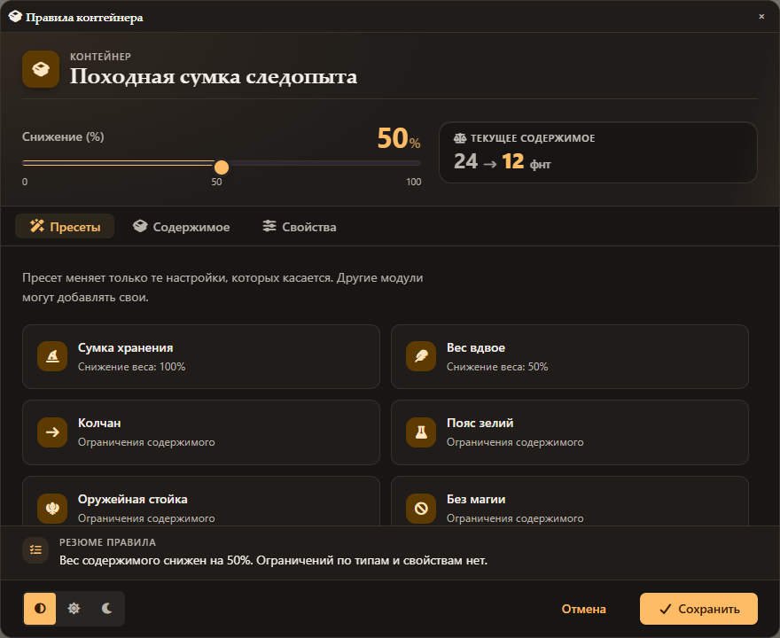
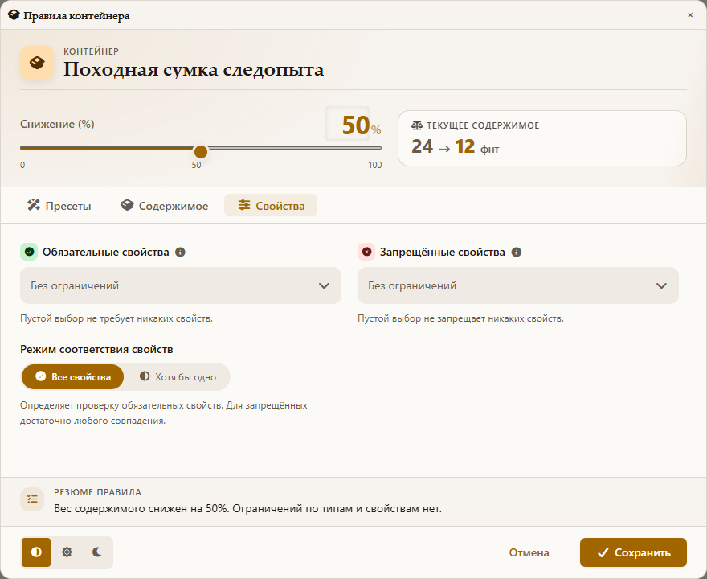

# Weighty Containers

**Управление весом, вместимостью и содержимым контейнеров в Foundry VTT для D&D5e.**

Настройте сумку, уменьшающую вес содержимого, колчан только для боеприпасов
или оружейную стойку с ограничениями по свойствам предметов. Модуль учитывает
правила при помещении предметов в контейнер и передаёт снижение веса в расчёты системы.

**Версия:** 3.5.1 · **Языки интерфейса:** русский и английский · **Автор:** TacticalOtaku

[Установка](#установка) · [Быстрый старт](#быстрый-старт) · [Настройки](#настройки-модуля) · [API](API.md) · [Дизайн-система](DESIGN.md)

## Возможности

- **Снижение веса от 0 до 100%.** Ползунок, числовой ввод и предварительный расчёт результата.
- **Контроль вместимости.** Проверка ограничений по весу или количеству предметов, заданных у контейнера.
- **Правила содержимого.** Разрешённые типы, категории и подтипы предметов.
- **Правила свойств.** Обязательные и запрещённые свойства D&D5e; соответствие всем обязательным свойствам или хотя бы одному.
- **Вложенные контейнеры.** Учёт содержимого вложенных сумок и проверка вместимости внешних контейнеров.
- **Готовые пресеты.** Быстрая настройка распространённых вариантов контейнеров.
- **Блокировка или предупреждение.** Выбор поведения при нарушении правил и получателей уведомлений.
- **Светлая и тёмная темы.** Следование теме Foundry или отдельный ручной выбор для модуля.
- **Удобное редактирование.** Поиск в списках, множественный выбор, резюме правил, подсветка конфликтов и предупреждение о несохранённых изменениях.
- **Доступ для игроков.** Владельцы контейнеров могут просматривать правила; изменять их может Мастер.

## Совместимость

| Компонент | Минимальная версия | Версия, указанная как проверенная в манифесте |
| --- | --- | --- |
| Foundry VTT | 14 | 14.367 |
| Система D&D5e | 5.3.3 | 5.3.3 |

Обязательных зависимостей среди модулей нет. **socketlib** поддерживается
опционально; без него используются штатные сокеты Foundry. **libWrapper не требуется.**

Модуль разработан для системы D&D5e. Совместимость с другими игровыми системами не заявлена.

## Установка

1. На экране настройки Foundry откройте **Add-on Modules → Install Module**.
2. Вставьте адрес ниже в поле **Manifest URL** и нажмите **Install**.
3. Откройте игровой мир с системой D&D5e.
4. В **Manage Modules** включите **Weighty Containers** и сохраните настройки.

```text
https://raw.githubusercontent.com/TacticalOtaku/Weighty-Containers/main/module.json
```

Архивы версий доступны в разделе [Releases](https://github.com/TacticalOtaku/Weighty-Containers/releases).
Для ручной установки распакуйте содержимое архива в `Data/modules/weighty-containers`:
файл `module.json` должен находиться непосредственно в этой папке.

## Быстрый старт

1. Войдите в мир как **Мастер** и откройте лист предмета типа **Container / Контейнер**.
2. Нажмите кнопку с шестерёнкой **«Правила контейнера»** в заголовке листа.
3. Установите процент снижения веса. Поле результата показывает вес текущего
   содержимого, когда он доступен; иначе используется пример веса.
4. При необходимости примените пресет или задайте ограничения вручную.
5. Проверьте резюме внизу окна и нажмите **«Сохранить»**.

Вместимость задаётся в штатных настройках самого контейнера D&D5e.
Правила модуля дополняют эти настройки.

Игроку-владельцу доступна кнопка просмотра с символом глаза. В режиме просмотра
можно переключать вкладки и тему, но нельзя изменять правила.

## Как работают правила

### Вес

Процент снижает учитываемый вес **содержимого**, а не собственный вес контейнера.
При снижении на 50% предметы общим весом 20 фунтов дают 10 фунтов содержимого;
собственный вес сумки учитывается отдельно.

Снижение включается в системный расчёт `contentsWeight`, на котором D&D5e
строит вес контейнера, показатель вместимости и нагрузку персонажа.
Вложенные снижения могут применяться последовательно. Системное свойство
`weightlessContents` также учитывается.

Модуль использует единицы и коэффициенты преобразования D&D5e, чтобы значения
совпадали с листами системы. Подробности расчётов приведены в [API.md](API.md#weight).

### Ограничения содержимого

На вкладке **«Ограничения»** выберите разрешённые типы и категории/подтипы.
Список категорий зависит от выбранных типов. Пустой выбор не ограничивает
соответствующий параметр.

Если после изменения типов ранее выбранные категории стали недоступны,
окно покажет предупреждение и предложит показать или удалить эти значения.

### Свойства

На вкладке **«Свойства»** задайте:

- **Обязательные свойства:** предмет должен иметь все выбранные свойства
  либо хотя бы одно — в зависимости от режима соответствия.
- **Запрещённые свойства:** достаточно любого совпадения, чтобы предмет нарушал правило.

Пустые списки не добавляют требований. Если одно свойство одновременно
обязательно и запрещено, сохранение недоступно до исправления конфликта.

Названия типов и свойств берутся из каталогов системы. Часть названий может
отображаться на английском даже при русском интерфейсе модуля.

## Пресеты

| Пресет | Изменения |
| --- | --- |
| Сумка хранения | Снижение веса содержимого на 100% |
| Вес вдвое | Снижение веса содержимого на 50% |
| Колчан | Расходуемые предметы с подтипом боеприпасов |
| Пояс зелий | Расходуемые предметы с подтипом зелий |
| Оружейная стойка | Предметы типа «Оружие» |
| Без магии | Запрет свойства `mgc` |
| Сбросить всё | Сброс снижения веса и ограничений, режим обязательных свойств «Все» |

Пресет меняет только перечисленные в нём параметры. Например, **«Колчан»**
сохраняет уже настроенный процент снижения веса. Применённые изменения нужно
сохранить кнопкой **«Сохранить»**.

Названия пресетов описывают настройку: модуль не создаёт предметы и не
реализует дополнительные эффекты магических предметов.

## Настройки модуля

Откройте настройки Foundry и найдите раздел **Weighty Containers**.

| Настройка | Назначение | По умолчанию |
| --- | --- | --- |
| Поведение при превышении | Блокировать действие или только предупреждать о нарушении вместимости/правил | Блокировать |
| Учитывать вложенные контейнеры | Обход вложенного содержимого при проверках загрузки | Включено |
| Кто видит отказы | Только действующий игрок; действующий игрок, владельцы и ГМы; либо все | Действующий игрок, владельцы и ГМы |
| Тема окон | Авто, светлая или тёмная | Авто |
| Текст уведомления о превышении | Собственный текст вместо стандартного сообщения о вместимости | Стандартное сообщение |
| Уровень логирования | Подробность диагностических записей | Предупреждения |

Настройки правил и уведомлений относятся к игровому миру. Тема и параметры
диагностики сохраняются отдельно для клиента.

## Интерфейс и темы

Окна используют дизайн-систему **Anvil**: нейтральные поверхности, янтарный
акцент, читаемые подписи и короткие анимации взаимодействия.

Переключатель внизу окна позволяет выбрать **«Авто»**, **«Светлая»** или
**«Тёмная»**. Автоматический режим следует теме Foundry; ручной выбор
переопределяет её для окон модуля. Изменение темы не сбрасывает черновик правил.

Интерфейс адаптируется к ширине окна, поддерживает клавиатуру и учитывает
системную настройку уменьшенного движения.

<details>
<summary>Превью светлой и тёмной тем</summary>

Изображения ниже получены на демонстрационных данных с шаблонами модуля и CSS Foundry.





</details>

Токены, компоненты, правила анимации и инструкция переноса оформления
в другие модули описаны в [DESIGN.md](DESIGN.md).

## Для разработчиков

Модуль предоставляет **Public API v2** для получения загрузки и вместимости,
проверки правил, открытия окна настроек и регистрации собственных пресетов.
API доступен после готовности модуля:

```js
Hooks.once("weighty-containers.ready", api => {
  api.registerRulePreset({
    id: "my-module.scroll-case",
    label: "Футляр для свитков",
    icon: "fas fa-scroll",
    config: {
      allowedTypes: ["consumable"],
      allowedSubtypes: ["scroll"]
    }
  });
});
```

Полное описание методов, событий и миграции с API v1: [API.md](API.md).

### Проверки

Исходники используют JavaScript ES modules; отдельная сборка для запуска в Foundry не требуется.
Для автоматических тестов нужен Node.js с поддержкой встроенного тестового раннера.

```sh
npm test
```

Сценарий проверки в игровом мире: [Foundry V14 smoke test](tests/manual/foundry-v14-smoke.md).

## Сообщить о проблеме

Создайте [issue](https://github.com/TacticalOtaku/Weighty-Containers/issues) и укажите:

- версии Foundry, D&D5e и Weighty Containers;
- шаги воспроизведения, ожидаемый и фактический результат;
- роль пользователя: Мастер или игрок;
- правила контейнера и затронутые предметы;
- снимок экрана и относящиеся к проблеме ошибки консоли, если они есть.

Для ошибок веса дополнительно укажите используемые единицы и наличие вложенных контейнеров.
